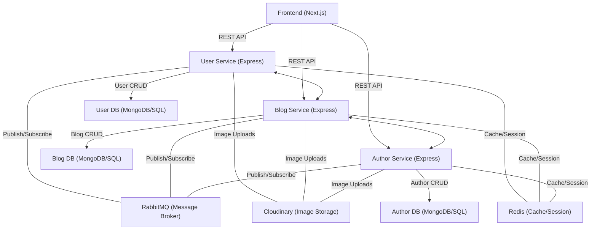

# Tech-Press Blog Platform

A modern, full-stack, microservices-based tech blogging platform built with **Next.js (React)** for the frontend and **Node.js/Express** microservices for the backend. Features include authentication, blog CRUD, comments, profile management, and more. The system uses both **SQL** and **MongoDB** databases for data storage, depending on the service and use case. 

This project also leverages **Cloudinary** for scalable image storage and delivery, **Redis** for fast caching and session management, and **RabbitMQ** for robust asynchronous message brokering between services.

---
# 🚀 Tech Stack

<p align="center">
  
  
  
  
  
  
  
  
  
  
  
  
  
</p>

---

## 🏗️ Architecture



---


## 🖼️ UI Screenshots

Below are some screenshots of the Tech-Press Blog Platform UI:

<!-- Example: Place your screenshots in the /public or /assets directory and reference them here. -->


---

## 📝 .env Structure

Below are example `.env` files for each service and the frontend. Copy these into the appropriate folders and fill in your own values.

### Frontend (`tech-press-blog/.env`)
```
NEXT_PUBLIC_API_URL=http://localhost:5002/api/v1
NEXT_PUBLIC_USER_API_URL=http://localhost:5001/api/v1/user1
NEXT_PUBLIC_CLOUDINARY_CLOUD_NAME=your_cloud_name
```

### User Service (`services/user1/.env`)
```
MONGO_URI=your_mongodb_uri
SQL_URI=your_sql_uri
JWT_SEC=your_jwt_secret
CLOUDINARY_CLOUD_NAME=your_cloud_name
CLOUDINARY_API_KEY=your_api_key
CLOUDINARY_API_SECRET=your_api_secret
REDIS_URL=redis://localhost:6379
RABBITMQ_URL=amqp://localhost
PORT=5001
```

### Blog Service (`services/blog/.env`)
```
MONGO_URI=your_mongodb_uri
SQL_URI=your_sql_uri
JWT_SEC=your_jwt_secret
CLOUDINARY_CLOUD_NAME=your_cloud_name
CLOUDINARY_API_KEY=your_api_key
CLOUDINARY_API_SECRET=your_api_secret
REDIS_URL=redis://localhost:6379
RABBITMQ_URL=amqp://localhost
PORT=5002
```

### Author Service (`services/author/.env`)
```
MONGO_URI=your_mongodb_uri
SQL_URI=your_sql_uri
JWT_SEC=your_jwt_secret
CLOUDINARY_CLOUD_NAME=your_cloud_name
CLOUDINARY_API_KEY=your_api_key
CLOUDINARY_API_SECRET=your_api_secret
REDIS_URL=redis://localhost:6379
RABBITMQ_URL=amqp://localhost
PORT=5003
```

> **Tip:** Never commit your `.env` files to version control. They are already included in `.gitignore`.

---

## ✨ Features

- **Authentication:** JWT-based login/register, Google OAuth, protected routes.
- **Blog Management:** Create, edit, delete, and view blogs with images, categories, and tags.
- **Comments:** Add comments to blogs.
- **Profile:** View and update user profiles, including profile picture upload.
- **Saved Blogs:** Save and view favorite blogs.
- **Responsive UI:** Modern, mobile-friendly design with Tailwind CSS.
- **Microservices:** Separate services for user, blog, and author management.
- **File Uploads:** Multer and Cloudinary integration for images.

---

## 📁 Project Structure

```
/tech-press-blog
  /app         # Next.js app directory (pages, layouts, etc.)
  /components  # Reusable React components
  /hooks       # Custom React hooks
  /lib         # Utility functions
  /public      # Static assets
  /styles      # Global and component styles
  /services
    /user1     # User microservice (Express, MongoDB/SQL)
    /blog      # Blog microservice (Express, MongoDB/SQL)
    /author    # Author microservice (Express, MongoDB/SQL)
```

---

## 🚀 Getting Started

### Prerequisites

- Node.js (18+ recommended)
- MongoDB instance (local or Atlas)
- Cloudinary account (for image uploads)

### 1. Clone the repository

```bash
git clone https://github.com/yourusername/tech-press-blog.git
cd tech-press-blog
```

### 2. Install dependencies

Install for each service and the frontend:

```bash
cd tech-press-blog
pnpm install # or npm install or yarn
cd services/user1 && pnpm install
cd ../blog && pnpm install
cd ../author && pnpm install
```

### 3. Environment Variables

Create `.env` files for each service and the frontend. Example for user1 service:

```
MONGO_URI=your_mongodb_uri
JWT_SEC=your_jwt_secret
CLOUDINARY_CLOUD_NAME=your_cloud_name
CLOUDINARY_API_KEY=your_api_key
CLOUDINARY_API_SECRET=your_api_secret
```

### 4. Start the Backend Services

Open three separate terminals (one for each service):

```bash
# Terminal 1: User Service
cd services/user1
pnpm dev

# Terminal 2: Blog Service
cd services/blog
pnpm dev

# Terminal 3: Author Service
cd services/author
pnpm dev
```

### 5. Start the Frontend

Open a new terminal and run:

```bash
cd tech-press-blog
pnpm dev
```

---

## 🛠️ Key Scripts

- `pnpm dev` - Start development server
- `pnpm build` - Build for production
- `pnpm start` - Start production server

---

## 📝 Contributing

1. Fork the repo
2. Create your feature branch (`git checkout -b feature/YourFeature`)
3. Commit your changes (`git commit -am 'Add some feature'`)
4. Push to the branch (`git push origin feature/YourFeature`)
5. Open a pull request


